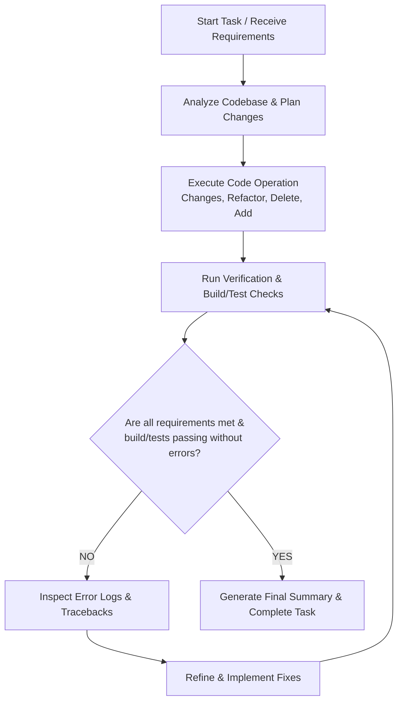

# AI Agent Development Workflow & Loop Engineering Protocol

This document provides mandatory operational instructions for AI agents working on this codebase. It governs all types of code operations including **Changes**, **Refactoring**, **Code Deletion**, **Revisions**, and **New Feature Additions**.

---

## 🔄 Agentic Loop Engineering (Mandatory Execution Loop)

> [!IMPORTANT]
> **CRITICAL RULE FOR AI AGENTS**: An AI agent **MUST NOT** stop, declare completion, or terminate the task process if the task results have not yet fully satisfied all specified requirements and expected outputs.
>
> If build steps fail, tests do not pass, or requirements remain unmet, the agent **MUST** continue the engineering loop, analyze the error output/logs, revise the code, and re-verify until 100% compliance and stability are achieved.

### The 5-Step Loop Engineering Lifecycle

1. **Requirement & Baseline Inspection**:
   - Understand full scope before editing.
   - Inspect authoritative files and dependency contracts. Do not guess variable names or schemas.

2. **Targeted Implementation**:
   - Apply precise, minimal-churn changes.
   - Preserve existing API signatures and valid design conventions.

3. **Empirical Verification (Build & Test)**:
   - Run compilation checks, unit tests, linters, or dev servers immediately after code changes.
   - Never rely on assumption or static inspection alone.

4. **Log Analysis & Dynamic Self-Correction**:
   - If errors, exceptions, or failing assertions occur:
     - Read the full, un-truncated error traceback.
     - Identify root causes (do not mask symptoms or comment out broken tests).
     - Modify code to correct the underlying defect.

5. **Loop Termination Criteria**:
   - The loop ends **ONLY** when:
     - All user requirements are fully satisfied.
     - All relevant build scripts, tests, and execution checks pass clean.
     - No introduced regressions or unintended side effects remain.

---

## 🛠️ Operating Instructions by Category

### 1. Code Changes & Modifications
- **Contract Preservation**: Verify all callers before modifying function arguments or return types. Update all invocation sites across the repository.
- **Scope Scoping**: Ensure new logic is strictly scoped and handles all boundary conditions (null/undefined checks, error states).
- **Log Inspection**: Base diagnosis on empirical log output, not assumptions.

### 2. Refactoring
- **Behavioral Parity**: Refactoring must maintain exact functional parity. Existing features must behave identically post-refactor.
- **Incremental Steps**: Execute refactoring in manageable steps and verify build status between steps.
- **Decoupling & Reuse**: Check existing utilities before writing duplicate helper classes or functions.

### 3. Code Deletion & Cleanup
- **Dependency Audit**: Perform exact grep searches across the workspace before deleting any file, function, component, or configuration.
- **Cascade Check**: Ensure removal of unused imports, dead references, unused routes, and obsolete test files.
- **Safety First**: Never delete active database tables, migration histories, or shared configuration files without explicit double-checking.

### 4. Revisions & Updates
- **Diff Verification**: Compare original behavior with revised behavior to ensure intent is fulfilled.
- **Documentation Sync**: Update corresponding docstrings, inline comments, API documentation, and README files when revising implementations.
- **Regression Testing**: Re-run existing test suites to confirm revisions did not break adjacent systems.

### 5. Adding New Features
- **Design Alignment**: Ensure new components follow existing architectural patterns, color schemes, and UI guidelines.
- **End-to-End Coverage**: Wire new features completely from UI/API to backend services and data stores.
- **No Mocking/Placeholder Code in Final Output**: Complete all logic flows without leaving stubbed or empty functions unless explicitly requested as a scaffold.

---